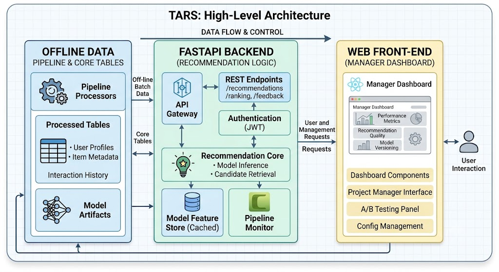
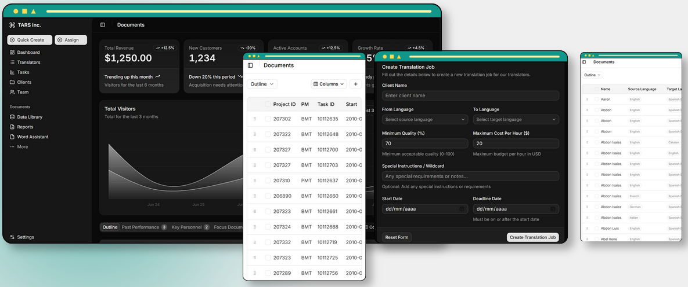

# Introduction

## Context

Translation companies operate as a marketplace between clients who need
content translated and a pool of translators with different skills,
languages, rates, schedules and track records. The company behind this
project manages a very large volume of work --- around 70,000 tasks per
year --- across many language pairs, many clients and many task types,
and it does so around the clock. Behind every one of those tasks sits a
small but real decision: who should do it?

## The Problem

Choosing a translator for a task is a constrained matching problem with
several objectives. The translator must:

- **cover the language pair** of the task (for example, English into
  Spanish);

- **be available** during the time window and have enough capacity to
  finish before the deadline;

- **fit the client's budget** --- their hourly rate must be acceptable
  given what the client pays;

- **meet the client's quality requirements** --- some clients impose a
  minimum quality level;

- ideally, **have experience** in the client's industry or in the
  specific type of task.

On top of these constraints, different clients have different
priorities. Some are most sensitive to price, some to quality, and some
to meeting the deadline. A good assignment is not simply the "best"
translator in the abstract, it is the translator who best fits *this*
task for *this* client under *these* priorities, without wasting a good
translator on a routine job or putting an underqualified person on a
hard one.

Today this matching is done manually. For each task, a PM relies on
experience to decide who is suitable, and then assigns the work. At the
company's scale, this is:

- **Expensive** --- about 30,000 PM hours per year are spent on
  assignment decisions that are largely repetitive.

- **Inconsistent** --- two PMs may handle the same task differently, and
  decisions reflect individual habits rather than the company's full
  history of what has actually worked.

- **Hard to scale** --- as volume grows, the manual approach does not.

## Objective

Our objective was to build a system that, given a new task, **recommends
the translators who best fit it** while doing so quickly, consistently,
transparently, and on the basis of the company's real historical data.
The system is explicitly designed to *support* the PM rather than
replace them: it produces a ranked, explained shortlist, and the PM
keeps the final decision. This keeps a human accountable for the outcome
and makes the tool realistic to use in practice.

# The Data

Understanding the data was both the starting point and one of the
hardest parts of the project, so we describe it in some detail here.

## Sources

The company provided four datasets (originally four sheets of a single
workbook):

- **Task history (`Data`)** --- the central log of past tasks. Each row
  records the project and task identifiers, the responsible PM team, the
  planned start and delivery times, the task type, the source and target
  languages, the assigned translator, a series of workflow timestamps
  (when the task was pre-assigned, when the translator was told to
  start, when they began working, when they delivered, when the PM
  received and closed it), the hours worked, the translator's rate, the
  total cost, a quality evaluation score, and a four-level
  classification of the client's industry (sector, industry group,
  industry, sub-industry).

- **Schedules (`Schedules`)** --- each translator's working hours (start
  and end of their workday) and which days of the week they work.

- **Clients (`Clients`)** --- each client's selling price per hour,
  their minimum acceptable quality score, and a "wildcard" field stating
  which requirement (quality or price) may be relaxed when no perfect
  match is available.

- **Translator rates and pairs (`TranslatorsCost+Pairs`)** --- for each
  translator, which language pairs they cover and their hourly rate for
  each.

## Scale and Shape of the Data

Our analysis was carried out on the full historical dataset. Its scale
is substantial (Table [1](#tab:data-scale){reference-type="ref"
reference="tab:data-scale"}). In total the history covers nearly **one
million tasks** spread across about **13,692 projects**, handled by **4
PM teams**, performed by **983 translators**, for **2,645 clients**,
across **13 task types**.

::: {#tab:data-scale}
  **Table**                     **Rows**   **Columns**
  ---------------------------- ---------- -------------
  Task history                  997,933        29
  Schedules                       983          11
  Clients                        2,645          6
  Translator rates and pairs     4,688          7

  : Size of the four source datasets.
:::

The data is highly concentrated in several ways, which has direct
consequences for the system:

- **Task types** --- proofreading (about 43%) and translation (about
  40%) together make up roughly 83% of all work. The remaining types
  (post-editing, miscellaneous, engineering, language lead, management,
  DTP, test, spotcheck, training, and a few others) form a long tail.

- **Languages** --- the work is mostly from English: English is the
  source language in about 97% of tasks. Then the target, Spanish
  (Iberian) is about 49% of tasks, followed by Galician, Catalan,
  Spanish (Latin America) and Basque.

- **Language pairs** --- the pair English $\rightarrow$ Spanish
  (Iberian) represents about 47% of all tasks. The translation work is
  therefore mostly a few pairs, and a lot of rare ones.

- **Clients** --- the top two clients alone account for about 43% of all
  tasks, and the top five for roughly 56%. Two industry sectors
  (Information Technology and Communication Services) together represent
  about 70% of the work.

- **Translators** --- workload is very unevenly distributed. The most
  active translator alone did about 6.5% of all tasks, and the top
  twenty translators together did close to half of all the work.

Every task is scored on quality on a 0--10 scale, with a mean of about
7.0 and a standard deviation of about 1.5. Translator hourly rates range
from 8 to 62, with a typical value around 16--17 on the task records.
Clients' selling prices range from 20 to 50 (median 35), and the selling
price is, on average, roughly double the translator cost rate, which is
where the company's margin comes from.

## Data Quality

The historical data, being real and accumulated over more than a decade,
contained a number of inconsistencies that we had to identify and
handle. The most important findings were:

- **Out-of-order timestamps** --- about 3.7% of tasks (around 36,800
  rows) had a start time recorded as *later* than the end time. The
  other workflow steps (pre-assigned $\rightarrow$ ready $\rightarrow$
  working $\rightarrow$ delivered) were consistent.

- **Zero-value tasks** --- about 7% of tasks (around 69,000 rows)
  recorded zero hours worked *and* zero cost, mostly in proofreading.

- **Outliers** --- hours worked ranged up to 725 in a single record and
  cost up to about 14,000, far above the typical values (median hours
  around 0.3, median cost around 5).

- **Same-language tasks** --- about 0.16% of tasks had the same source
  and target language, which is not a normal translation.

- **Impossible dates** --- isolated records dated 1956 and 2050 clearly
  are not correct.

- **Encoding artefacts** --- some names and language labels carried
  character-encoding problems (for example, accented characters rendered
  incorrectly).

- **Missing values** --- these were, by contrast, almost negligible:
  only a handful of rows were missing cost, rate or timestamps, and
  there were no exact duplicate rows in any table.

A reassuring finding was that the four datasets join together almost
perfectly: essentially every task in the history matched a client, a
schedule and a rate record, with only five translator/language-pair
combinations failing to match (and those were traced to spelling
variants rather than genuinely missing data). This meant we could
combine the sources with confidence.

## Relationships in the Data

Beyond describing the data, we studied how the variables relate to each
other, since this directly informs what a recommendation model can and
cannot do.

- **Cost does not buy quality.** The correlation between a translator's
  rate and the quality score of their work is essentially zero (about
  $-$`<!-- -->`{=html}0.01). Paying more does not lead to better
  results.

- **Quality is hard to predict.** None of the available features carry
  much signal about the quality of a future task. The best predictors
  are a translator's *prior average quality* (on similar task types,
  language pairs, or overall), but even these are weak.

- **Quality and punctuality are largely independent.** Being on time and
  producing high-quality work are almost unrelated (correlation about
  0.02 at the task level). This is an important finding: it means the
  system should treat these as two separate dimensions rather than
  assuming a "good" translator is good on both at once.

- **Some engineered features were redundant or degenerate.** Several
  candidate features turned out to be perfectly correlated with each
  other (for example, two different ways of computing margin), or
  constant across all rows, so they provided no information.

## New Translators

At the beginning, we also worried about new entities with no history.
But we found that this was not really the issue: there were essentially
**no translators with zero history**. The real problem was **sparse
history**, a few hundred translators had only a handful of scored tasks,
which makes their estimates unreliable. We also found that a
translator's quality estimate tends to stabilise after only a small
number of tasks (a median of about four), though some take many more.
This changed our perspective from how to handle the absence of a
translator's record, to how much to trust a track record with few tasks.

## The Five Recommendation Dimensions

From all of the above, we settled on five dimensions that capture what
makes a translator a good fit for a task, and which the system is built
around:

1.  **Experience** --- accumulated hours working for the client, the
    client's sector or industry, and the task type.

2.  **Quality** --- the translator's historical quality evaluation
    scores.

3.  **Punctuality** --- how reliably the translator delivers on time.

4.  **Cost** --- the translator's rate against the client's budget (the
    margin).

5.  **Availability** --- whether the translator's schedule fits the
    task's time window and deadline.

# Technical Design

## Overview

The system is a pipeline that turns the raw company data into a ranked,
explained recommendation for a given task. It separates offline data
preparation (done once) from the online recommendation flow (run for
each task), so the live response is fast. The main components are a
data-preparation stage, a feature-building stage, a constraint engine, a
ranking step, an output formatter, a backend service, a front-end
interface, and an evaluation script.

## System Architecture

TARS is organised in three layers with clear boundaries between them,
shown in Figure [1](#fig:architecture){reference-type="ref"
reference="fig:architecture"}.

**The recommendation core** is a set of Python modules (built on
`pandas`) that contain all of the logic described in this section: data
loading, cleaning and feature building, the constraint engine, the two
rankers, and the output formatter. It is written to be independent of
how it is called, so exactly the same code runs from a command-line
script and from the web service.

**The backend API** is a `FastAPI` service that sits between the core
and the front-end. It exposes a `/recommendations` endpoint that takes a
task's parameters, runs the full pipeline, and returns the ranked
shortlist together with the requirements the system derived for the
task; alongside it, a set of read-only endpoints (`/translators`,
`/clients`, `/tasks`, `/schedules`) let the interface browse the
underlying data with pagination, served from a small SQLite database
built from the source tables. The front-end only ever talks to these
endpoints, never to the recommendation code directly.

**The web front-end** is a single-page application that project managers
use in the browser; it calls the API over HTTP and renders the
recommendations and the supporting data.

**Orchestration.** For development the front-end and the backend are
containerised and started together with a single `docker compose`
command, and a bootstrap script prepares the data and the Python
environment, so the whole system can be brought up from a clean
checkout.

<figure id="fig:architecture" data-latex-placement="t">

<figcaption>High-level architecture of TARS: an offline data pipeline
produces the processed tables that the recommendation core reads; a
FastAPI backend exposes the core to a React front-end used by the
project managers.</figcaption>
</figure>

## Data Preparation and Feature Building

The raw workbook is first converted into clean per-table CSV files, and
then into a set of processed tables read at run time. Preparation cleans
the task history (parsing timestamps, computing how long each task took,
deriving an on-time flag, and dropping inconsistent rows) and builds a
per-translator statistics table. For each translator this brings
together, from all four sources: their rate for each language pair;
their average quality; their on-time score; their experience by task
type; and their experience by industry at three levels --- sub-industry,
industry, and industry group. This hierarchical view of experience is
what lets the engine reason about expertise at different levels of
specificity. We keep the raw data untouched and write all
transformations into separate folders, so the process can be re-run from
scratch, and a single bootstrap script sets up the environment and
builds these tables for a new contributor.

## The Constraint Engine

The core of the system decides which translators are eligible for a
task. It first looks up the client's requirements (budget, minimum
quality, wildcard preference) and derives the relevant industries from
the client's history and the delivery window from the dates. It then
applies hard constraints that remove translators who cannot do the task:
wrong language pair, rate above budget, quality below the client's
minimum, on-time score below threshold, no availability or insufficient
daily capacity to meet the deadline, and no experience in the required
field.

Some task types change these rules, reflecting real business policy:
**test** tasks ignore the budget and select on quality; **training**
tasks drop the quality and experience requirements; a **translation
followed by proofreading** relaxes the quality threshold slightly; and
**proofreading** or **spotcheck** tasks must go to a different and more
experienced translator than the one who did the previous step.

## Graceful Relaxation and Splitting

In a marketplace this constrained, it frequently happens that no
translator satisfies every hard requirement. Rather than return "no
match", the engine relaxes the requirements step by step, in a
deliberate order, stopping as soon as candidates appear: first it looks
for a specialist at the narrowest (sub-industry) level; then it broadens
the required expertise to the industry and industry-group levels; then
it applies the client's wildcard, relaxing only the single dimension the
client cares least about (lowering minimum quality, raising the budget
by 25%, or easing the on-time and scheduling requirements); and finally
it relaxes globally as a last resort. This ordering encodes the idea
that we would rather find a less specialised translator than violate the
client's stated priority. When relaxation still fails --- typically
because the task is too large for one person in the time available ---
the engine splits the work, either across days for one translator or
across several translators working in parallel. Crucially, whenever the
system relaxes something, it records what it relaxed, so the
recommendation can be explained honestly.

## Ranking: Rule-Based Scorer

Once the engine produces a set of eligible translators, they are ranked.
Our first ranker is a transparent rule-based score out of 100, combining
four normalised components --- quality, reliability, cost margin and
experience --- with weights that shift according to the client's
wildcard (Table [2](#tab:weights){reference-type="ref"
reference="tab:weights"}).

::: {#tab:weights}
  **Mode**              **Qual.**   **Rel.**   **Margin**   **Exp.**
  -------------------- ----------- ---------- ------------ ----------
  Balanced (default)       40          30          20          10
  Quality-sensitive        60          20          10          10
  Price-sensitive          20          20          50          10
  Deadline-sensitive       20          60          10          10
  Test task                80          0           0           20

  : Ranking weights by client priority (wildcard).
:::

A notable design choice is what we call **resource conservation**.
Outside explicitly quality-driven cases, the scorer does not simply
reward the highest quality and most experience; it rewards a good-enough
fit, so a translator who comfortably clears the client's requirements
scores higher than one who massively exceeds them. The reasoning is
practical: putting the company's most expert translators on routine
tasks wastes them when they could be reserved for demanding work. This
is a deliberate business stance rather than a pure "best translator
wins" approach, and it is one of the points we would want to validate
carefully with the company.

## Ranking: Machine-Learning Model

Our second ranker is a gradient-boosted regression model that predicts
an "efficiency" score for each eligible candidate from features such as
the client's budget and required quality, the translator's quality,
on-time record and rate, and the gaps between them. The intention was
the same "good fit, not overkill" idea expressed as a learned function
rather than fixed weights. Both rankers consume the same eligible set,
so the constraint logic is shared and only the final ordering differs.

## Output and Explainability

Whichever ranker is used, the system returns the top recommendations (by
default the top ten) as a table in which each row carries not just the
translator and the score, but the underlying values: their rate for the
language pair, their daily capacity, their average quality, their
on-time score, and the relevant experience figure. This is central to
the product: the PM does not just see *who* is recommended, but *why*,
and can therefore trust or overrule the suggestion with full
information.

## The Backend Service

To make the system usable from a web interface, we built a backend
service that exposes it over HTTP. It offers an endpoint that takes a
task's parameters and returns the ranked recommendations, plus a set of
endpoints that let the interface browse the underlying data ---
translators, clients, tasks and schedules --- with pagination. The
recommendation results are returned in a clean structured form,
including the requirements the system derived for the task, so the
front-end can display the full rationale.

## The Web Interface

The front-end is a single-page web application aimed at project
managers, built with React, Vite and TypeScript. It provides a dashboard
and dedicated views for assigning a task, comparing translators, and
browsing the translators, clients and tasks in the system
(Figure [2](#fig:webui){reference-type="ref" reference="fig:webui"}). A
project manager fills in the task parameters, submits them, and gets
back the ranked shortlist with the per-dimension values behind each
recommendation. The interface communicates with the backend only through
the API described above, keeping a clean separation between the user
interface and the recommendation logic, so that either side can evolve
independently.

<figure id="fig:webui" data-latex-placement="ht">

<figcaption>The project-manager web interface, showing the dashboard and
the task creation panel.</figcaption>
</figure>

## Evaluation

To judge whether the recommendations are actually good, we wrote a
backtesting script. It takes historical tasks, hides the translator who
was really chosen, runs the full system on the task, and checks where
the real translator appears in the recommended list. From this we can
compute concrete measures: how often the real translator is in the top
$N$ (the hit rate), how often they appear among the eligible candidates
at all (recall), and their average rank when they do
(Figure [3](#fig:results){reference-type="ref"
reference="fig:results"}). This gives an objective, data-grounded way to
track whether changes to the system make it better or worse, rather than
relying on intuition.

<figure id="fig:results" data-latex-placement="ht">

<figcaption>Backtesting results: how often the translator actually
chosen for a historical task appears among the system’s top
recommendations.</figcaption>
</figure>

## Reproducibility and Deployment

The whole project is set up to be reproducible. A single bootstrap
script creates a clean environment, installs the dependencies, and
builds the data tables the system needs, so that a fresh copy of the
repository can be made to run with one command. The web interface and
the backend can be brought up together for development, and the data
flow --- from raw files, to intermediate CSVs, to the final processed
tables the system reads --- is documented and scripted end to end.

# Business (B2B) Perspective

Technically, TARS is a recommendation pipeline; commercially, it is a
decision-support tool for project managers that targets one of the
company's largest hidden costs. Its value falls along four lines.
**Speed and cost**: replacing the manual search with an instant ranked
shortlist removes the bulk of the 30,000 PM hours spent on assignment,
letting PMs handle more tasks and focus on decisions that genuinely need
judgment. **Consistency and institutional memory**: every task is
evaluated the same way and on the basis of the company's entire history,
removing variation between managers and capturing knowledge that would
otherwise live only in individuals' heads. **Client-aware flexibility**:
the wildcard mechanism means a price-sensitive and a quality-sensitive
client asking for the same task get appropriately different
recommendations, automatically. **Trust through explainability**: every
recommendation comes with the figures behind it, and the system is
honest about when it has relaxed a requirement, which is what makes the
difference between a tool PMs use and a black box they ignore. Taken
together, this positions TARS not as an automation that removes the PM,
but as a force multiplier that keeps a human firmly in control --- which
is also what makes it realistic to roll out in a real operation.

# Difficulties and Teamwork

## Messy Real-World Data

By far the biggest challenge was the data. A decade of records contained
the inconsistencies described above, none of them obvious until we
looked, and each forcing a decision about whether to drop, correct, or
flag the affected rows. Our approach was to make the data-quality
analysis the first piece of work, write it up clearly, and treat its
conclusions as the shared foundation everyone else built on, so the rest
of the team did not keep rediscovering the same problems.

## Working at Scale

Nearly a million rows was enough to cause practical problems: some
analysis ran out of memory computing statistics over the whole dataset
at once. This pushed us toward a more disciplined design --- compute
heavy features once and store them, sample where a full pass was not
necessary, and keep the expensive preparation strictly separate from the
fast live step.

## Deciding What to Optimise For

A more conceptual difficulty was deciding what "the best translator"
even means. Our analysis showed that quality is hard to predict and
unrelated to cost, that punctuality is more predictable and driven by
availability, and that the two are essentially independent. These
findings pushed us toward treating the dimensions separately and made us
appreciate that a clear, explainable rule-based approach was at least as
defensible as a more complex model.

## Teamwork

We organised the work with an issue tracker, breaking the project into
clear areas --- data analysis and feature creation, the constraint
engine, the ranking models, the backend, and the front-end --- and
assigning owners to each. We used separate branches so people could work
in parallel without breaking one another's code, and kept a shared log
of key decisions (including how we used AI tools) so everyone worked
from the same understanding. The main friction was the ordinary one of
integration: making sure independently developed components agreed on
the same formats. We addressed this by agreeing on a single documented
data flow and a clear contract between the front-end and the backend, so
each part could be developed independently against a stable interface.

# Conclusion

## How Our Solution Helps People

TARS tackles a real, costly and repetitive problem. By turning
translator assignment into a fast, consistent and explainable
recommendation, it gives PMs back a large amount of time and removes
much of the inconsistency of manual decisions, while grounding those
decisions in the company's own history rather than in individual memory.
For the company that means lower operational cost and more defensible
decisions; for translators, work distributed on the basis of genuine fit
and track record rather than on which manager thinks of them first,
which is fairer. Throughout, the system assists rather than replaces: it
offers a transparent starting point and leaves the final, accountable
decision with a person.

## How We Could Have Made It Better

We are clear-eyed about the system's limitations. We would ground the
machine-learning model in real outcomes --- training it on the quality
actually delivered or on whether tasks were on time, rather than on a
designed efficiency score, so it discovers patterns the hand-set rules
miss; our own analysis even points the way, since punctuality is the
dimension that is actually predictable. We would evaluate at full scale,
running the backtesting framework across the whole history to turn "we
think this works" into evidence. We would simplify and unify the few
places where the system grew two parallel ways of doing the same thing.
We would add a fuller set of automated tests for the most intricate
logic and harden the backend before any real deployment. And we would
validate the business assumptions --- the resource-conservation choice
and the exact relaxation and weighting numbers --- against what the
company actually wants, ideally with PMs in the loop.

## What We Would Change About the Process

If we started again, we would invest in the data-quality analysis even
earlier and treat it explicitly as the foundation for everything else,
since so many later decisions depended on understanding the data. We
would decide sooner what precisely we wanted the model to predict,
rather than building the modelling machinery first and questioning the
target afterwards. And we would lock in the shared data formats and
component boundaries earlier, to reduce the integration friction of
keeping independently built parts in sync. None of these are surprising
lessons --- they are the normal trade-offs of building something real
under time pressure --- but they are the ones we felt most directly and
would carry into the next project.

## Closing

TARS demonstrates that a large, expensive, manual decision can be turned
into a fast, consistent and explainable recommendation using a company's
own historical data. The result is not a system that decides for people,
but one that helps them decide better --- saving time, spreading work
more fairly, and capturing institutional knowledge that would otherwise
stay locked in individual heads. There is clear room to make it more
accurate and more polished, but as a foundation it shows both the value
of the idea and a realistic path to delivering it.

# References {#references .unnumbered}

::: enumerate
The pandas development team. pandas: Python Data Analysis Library.
<https://pandas.pydata.org>

T. Chen and C. Guestrin. XGBoost: A Scalable Tree Boosting System.
<https://xgboost.readthedocs.io>

Scikit-learn developers. Scikit-learn: Machine Learning in Python.
<https://scikit-learn.org>

S. Ramírez. FastAPI. <https://fastapi.tiangolo.com>

Meta Open Source. React. <https://react.dev>
:::
